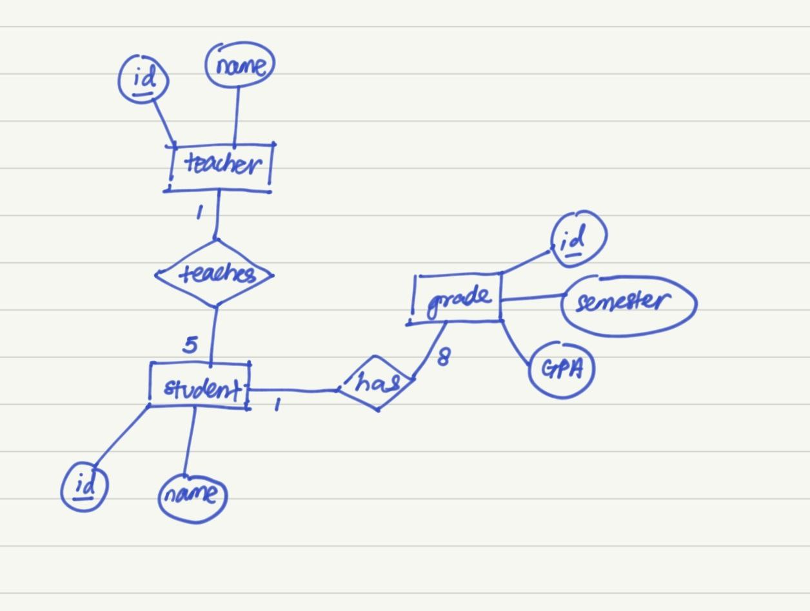

# Elliot Phua TMO THT

Hi, my name is [Elliot Phua](https://www.linkedin.com/in/elliotphua/). This is my submission for the GovTech TMO THT 2025, **Question 2 - REST APIs**.

## Outline

The application is a GPA monitoring tool to view the cumulative grades of students within a timeframe between semester 1 to semester 8. The grading system used is out of 5.0. There is also a feature to update a student's assigned teacher.

## Deployment / Demo

The backend service is deployed using Railway.app . This is the [base url](elliotphuagovtechtmotht-production.up.railway.app) of the APIs. There is also a frontend interface deployed through Vercel to [try out the app here](https://elliot-phua-gov-tech-tmo-tht.vercel.app/). It might take a few seconds to fetch the data on page load.

The database is managed on Neon PostgreSQL.


## Table of Content

- [Elliot Phua TMO THT](#elliot-phua-tmo-tht)
  - [Outline](#outline)
  - [Deployment / Demo](#deployment--demo)
  - [Table of Content](#table-of-content)
  - [Set-up Instructions](#set-up-instructions)
    - [Download the files](#download-the-files)
    - [Install Dependencies](#install-dependencies)
  - [Considerations \& Design Decisions](#considerations--design-decisions)
    - [Requirement 1: SQL Database Design](#requirement-1-sql-database-design)
      - [a. Entity Relations Diagram](#a-entity-relations-diagram)
      - [b. Relationships \& Relations Mapping](#b-relationships--relations-mapping)
      - [c. SQL Scripts To Insert Into Database](#c-sql-scripts-to-insert-into-database)
    - [Requirement 2: Get All Students Data API](#requirement-2-get-all-students-data-api)
      - [Success Response (200 OK):](#success-response-200-ok)
      - [Error Response (400)](#error-response-400)
    - [Requirement 3: Update Assigned Teacher To A Student](#requirement-3-update-assigned-teacher-to-a-student)
      - [Success Response (200 OK)](#success-response-200-ok-1)
      - [Error Responses (400)](#error-responses-400)
    - [Bonus Requirement 4: Get Cumulative GPA Of All Students In A Specific Timeframe](#bonus-requirement-4-get-cumulative-gpa-of-all-students-in-a-specific-timeframe)
      - [Success Response (200 OK)](#success-response-200-ok-2)
      - [Error Response (400)](#error-response-400-1)
      - [Error Response (400)](#error-response-400-2)
      - [Error Response (500)](#error-response-500)
  - [Assumptions](#assumptions)
    - [1) No Authentication required](#1-no-authentication-required)
    - [2) Each Table Uses Id as Primary Key](#2-each-table-uses-id-as-primary-key)
  - [Additional](#additional)

## Set-up Instructions

This section will guide you through setting up and running the backend application.

### Download the files

On your device terminal, ```git clone``` the repository in your chosen directory:

```bash
git clone https://github.com/ElliotMonde/ElliotPhua_GovTech_TMO_THT.git
```

The application folders and files should appear in your directory in such structure:

```
ElliotPhua_GovTech_TMO_THT  
  │
  └───/frontend
  │   └─── package.json
  │   └─── src
  │   │    └─── App.jsx
  │   │    └─── ...
  │   └─── ...
  │
  └───/backend
  │   └─── requirements.txt
  │   └─── app.py
  │   └─── ...
  │
  │
  └──── README.md
  └─── demo.gif 
        ...
```

### Install Dependencies

The backend application can be ran locally by navigating to the ```/backend``` folder. Then install the dependencies from ```requirements.txt```.

To do so, on your terminal:

```bash
pip install -r requirements.txt
```

After installing the dependencies, you can run the application to demo using the command:

```bash
python app.py
```

You should see that the app is successfully running with a similar message:

```yaml
$ python app.py

Connection pool created successfully
Tables created successfully.
 * Serving Flask app 'app'
 * Debug mode: on
WARNING: This is a development server. Do not use it in a production deployment. Use a production WSGI server instead.
 * Running on http://127.0.0.1:5000
Press CTRL+C to quit
 * Restarting with stat
Connection pool created successfully
Tables created successfully.
 * Debugger is active!
```

You will be able to call the APIs at the base url (<http://127.0.0.1:5000> in this local demo). 

The frontend application set-up instructions will be detailed at the end of the ```README.md``` as this submission is for **Question 2 - REST APIs** only.

See below on the APIs' request parameters and responses.

## Considerations & Design Decisions

### Requirement 1: SQL Database Design

#### a. Entity Relations Diagram



A teacher &rarr; teaches multiple (5) &rarr; students

A student &rarr; is taught by &rarr; one teacher

A student &rarr; has multiple (8) &rarr; grades, one for each of 8 semesters

A grade &rarr; belongs to &rarr; one student

#### b. Relationships & Relations Mapping

Relationships/Entities and Attributes:

- student(<u>student_id</u>, student_name)
- teacher(<u>teacher_id</u>, teacher_name)
- grade(<u>grade_id</u>, semester, grade)

Relations Model:

- has(<u>student_id</u>, <u>grade_id</u>, student_name, grade, semester)
- teaches(<u>teacher_id</u>, <u>student_id</u>, teacher_name, student_name)

#### c. SQL Scripts To Insert Into Database

The database instance is hosted on Neon. The database connection string can be attained by setting up a database instance on Neon (my database connection string will not be included in this repo). You can add your own connection string in the ```neon-connect.py```, or as a environment variable:

```yml
DATABASE_URL=postgresql://example_connection_string.neon.tech/
```

Using ```psycopg2``` and ```neon-connect``` libraries, running ```init_tables.py``` will generate the ```teachers```, ```students```, and ```grades``` tables in the database.

Similarly, running ```sample_data.py``` will populate the tables with some sample data of 10 students, 2 teachers, and the student grades for all 8 semesters.

Below are the SQL Scripts:

```SQL
--- Creates the teachers table with name field, with id as the primary key.

CREATE TABLE IF NOT EXISTS teachers (
    id SERIAL PRIMARY KEY,
    name VARCHAR(255) NOT NULL
    );


--- Creates the students table with name, teacher_id fields, with id as the primary key. The foreign key teacher_id maps to the teachers table.

CREATE TABLE IF NOT EXISTS students (
    id SERIAL PRIMARY KEY,
    name VARCHAR(255) NOT NULL,
    teacher_id INT REFERENCES teachers(id) ON DELETE SET NULL
    );

--- Creates the grades table with student_id, semester, grade fields, with id as the primary key. The foreign key student_id is mapped to the students table.

CREATE TABLE IF NOT EXISTS grades (
    id SERIAL PRIMARY KEY,
    student_id INT REFERENCES students(id) ON DELETE CASCADE,
    semester INT NOT NULL,
    grade NUMERIC(2,1) NOT NULL CHECK (grade >= 0.0 AND grade <= 5.0)
    );
```
&nbsp;

### Requirement 2: Get All Students Data API

The API gets the name, teacher name, and cumulative grade (from semester 1 to 8) from all students.

API URL: **{Base URL}/students**

Method: **GET**


#### Success Response (200 OK):

```JSON
    
[
    {
        "cumulative_GPA": 3.59,
        "student_id": 1,
        "student_name": "Andy",
        "teacher_name": "Amy"
    },
    {
        "cumulative_GPA": 2.96,
        "student_id": 2,
        "student_name": "Bryan",
        "teacher_name": "Amy"
    },
    {
        "cumulative_GPA": 3.26,
        "student_id": 3,
        "student_name": "Charm",
        "teacher_name": "Amy"
    },
    {
        "cumulative_GPA": 3.59,
        "student_id": 4,
        "student_name": "Danielle",
        "teacher_name": "Betty"
    },
    {
        "cumulative_GPA": 2.96,
        "student_id": 5,
        "student_name": "Elliot",
        "teacher_name": "Betty"
    },
    {
        "cumulative_GPA": 3.26,
        "student_id": 6,
        "student_name": "Fredrick",
        "teacher_name": "Amy"
    },
    {
        "cumulative_GPA": 3.59,
        "student_id": 7,
        "student_name": "Godfry",
        "teacher_name": "Betty"
    },
    {
        "cumulative_GPA": 2.96,
        "student_id": 8,
        "student_name": "Hildy",
        "teacher_name": "Amy"
    },
    {
        "cumulative_GPA": 3.26,
        "student_id": 9,
        "student_name": "Indigo",
        "teacher_name": "Betty"
    },
    {
        "cumulative_GPA": 3.59,
        "student_id": 10,
        "student_name": "Jessica",
        "teacher_name": "Betty"
    }
]
```

#### Error Response (400)

```JSON
{"error":"Unable to fetch student details."}
```

&nbsp;

### Requirement 3: Update Assigned Teacher To A Student

The API is called to assign a new teacher to a particular student. It takes a path parameter ```{student_id}``` which is the unique identifier for each student in the database. There is a required request parameter ```new_teacher_id``` which is the unique identifier of the new teacher to assign to the student.

API URL: **{Base URL}/student/{student_id}**

Method: **PATCH**

Request Body:

```json
{
    "new_teacher_id" : 1
}
// where 1 is the teacher's id in this example
```

#### Success Response (200 OK)

```json
{"message":"Successfully updated student's teacher."}
```

#### Error Responses (400)

```json
{"error": "Failed to update student's teacher. Either student not found or no change was made"}
```

```json
{"error": "Unable to update student's teacher."}
```

&nbsp;

### Bonus Requirement 4: Get Cumulative GPA Of All Students In A Specific Timeframe

The API gets the cumulative GPA of all students from a timeframe provided by the earliest semester and latest semester. E.g. If earliest semester is 3 and latest semester is 5, the API will return the cumulative GPA from semesters 3 to 5 of each student.

The query parameters are both optional. Both takes in integer values from 1 to 8. If no query parameters are specified, earliest semester will default to 1, and latest semester will default to 8.

API URL: **{Base URL}/students-grades?earliest_semester={earliest_semester}&latest_semester={latest_semester}**

Method: **GET**

#### Success Response (200 OK)

```json
[
    {
        "cumulative_GPA": 3.74,
        "student_id": 1,
        "student_name": "Andy",
        "teacher_name": "Amy"
    },
    {
        "cumulative_GPA": 2.74,
        "student_id": 2,
        "student_name": "Bryan",
        "teacher_name": "Betty"
    },
    {
        "cumulative_GPA": 3.37,
        "student_id": 3,
        "student_name": "Charm",
        "teacher_name": "Amy"
    },
    {
        "cumulative_GPA": 3.74,
        "student_id": 4,
        "student_name": "Danielle",
        "teacher_name": "Betty"
    },
    {
        "cumulative_GPA": 2.74,
        "student_id": 5,
        "student_name": "Elliot",
        "teacher_name": "Amy"
    },
    {
        "cumulative_GPA": 3.37,
        "student_id": 6,
        "student_name": "Fredrick",
        "teacher_name": "Amy"
    },
    {
        "cumulative_GPA": 3.74,
        "student_id": 7,
        "student_name": "Godfry",
        "teacher_name": "Betty"
    },
    {
        "cumulative_GPA": 2.74,
        "student_id": 8,
        "student_name": "Hildy",
        "teacher_name": "Amy"
    },
    {
        "cumulative_GPA": 3.37,
        "student_id": 9,
        "student_name": "Indigo",
        "teacher_name": "Betty"
    },
    {
        "cumulative_GPA": 3.74,
        "student_id": 10,
        "student_name": "Jessica",
        "teacher_name": "Betty"
    }
]
```

#### Error Response (400)

```json
{"error" : "Earliest and latest semester must have a value between 1 and 8 inclusive."}
```

#### Error Response (400)

```json
{"error": "Earliest semester must have a lower value than latest semester."}
```


#### Error Response (500)

```json
{"error": "Unable to retrieve students' grades."}
```

&nbsp;

## Assumptions

### 1) No Authentication required

The APIs can be called without authentication and can be called by anyone in this demo.

### 2) Each Table Uses Id as Primary Key

The Update Teacher API uses a student ID, which is the primary key in the students table in the database. It's assumed the student ID is a unique identifier that can be used to identify students if the student name is not unique. 

This is the same for teachers. Hence, the students table references the teachers table by using the teacher_id as the foreign key, and vice versa.


## Additional

To set up the frontend application locally, navigate to the ```/frontend``` directory. Run ```npm install``` on the device terminal, which will install the required dependencies specified in the ```package.json```. After that, run ```npm start``` to run the program. The program currently calls APIs of the backend service hosted on the [Railway.app instance](elliotphuagovtechtmotht-production.up.railway.app). To change this, you can change the API urls in the ```Table.jsx``` component in the ```src/components``` folder.

To quit the application, press ```ctrl + c``` on the running terminal.
